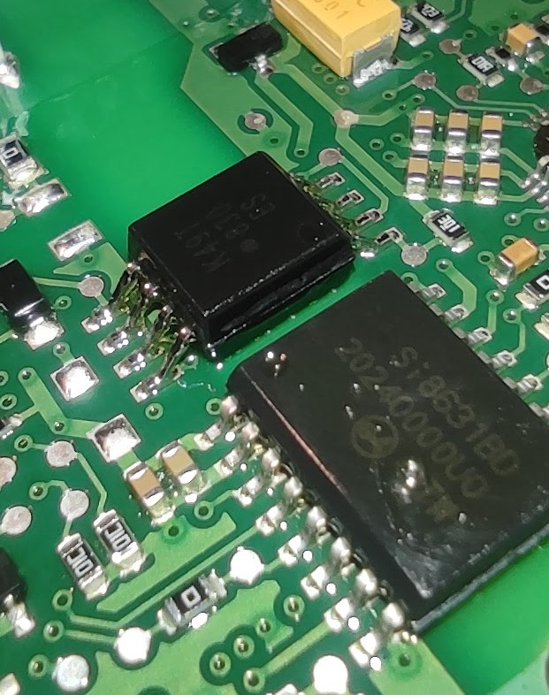
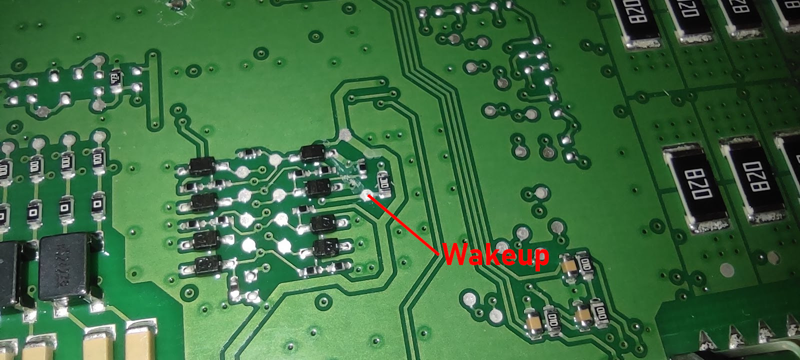
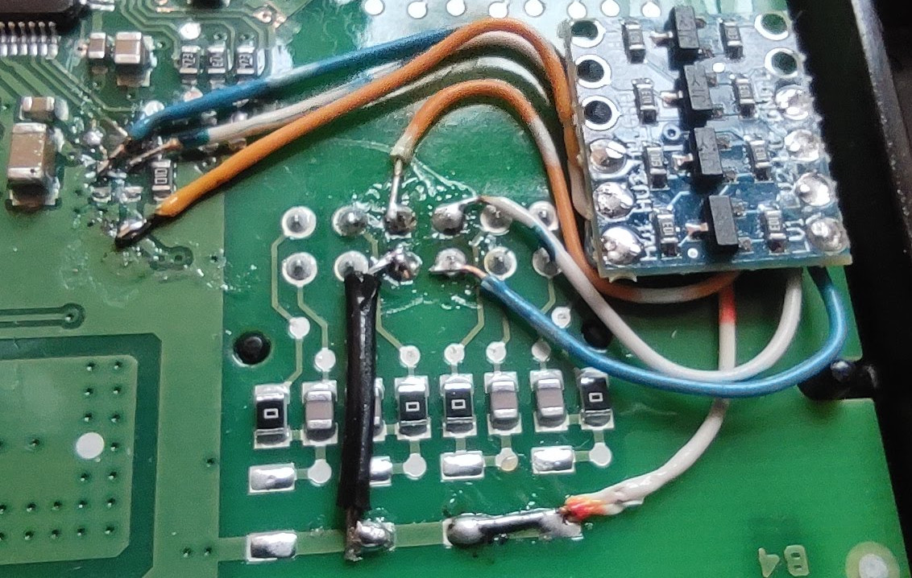

# bmsSerial
Code to talk to a bq76PL455A BMS chip, as used in BMW PHEV battery packs

If using a complete BMW PHEV pack (5 or 6 modules), then I would recommend using simpBMS, which talks to the primary CSC (white case) over CAN, and requires no hardware modifications (aside from a bit of wiring perhaps). If, however, you need to use a partial pack, or more than one pack, this code will allow from one to 16 modules in a single string. (Using the BMW hardware over CAN will work for partial packs, but will not allow balancing. The BMW hardware over CAN will also not allow >6 (or 5) modules in a string.)

# Required Hardware Modifications
This code talks to the first CSC over UART, which then communicates with any additional CSCs over the TI twisted pair comms. You will need to perform a small modification to the first CSC to get to the UART lines. It is possible to use the primary CSC (white case) or any of the other CSCs (black case) as your first module. Subsequent modules use the BMW harness (modified if required for different numbers of modules) to connect up.

# Using the white primary CSC
The primary CSC uses two isolation ICs:

This means that the CAN side of the module is isolated from the bq76PL455A half, and thus isolated from the battery pack. During development of this code, I connected to these ICs with a datalogger to read the UART being sent back and forth, and it would be straightforward to use these connections and bypass the CAN side ICs.

Black is ground, White is wakeup, Grey is Fault, Purple TX, Blue RX.

# Using a black secondary CSC
If splitting a pack into two (for example, making two packs of three modules) it will be necessary to use one of the secondary CSCs as one of your first CSCs. The secondary CSCs do not have their UART exposed to the outside world, not even via a CAN module of course as with the primary (white case) CSC. However, the UART TX, RX, and Wakeup pins (as well as Fault etc) aren't too difficult to access.

The Wakeup pin is difficult to solder to (small size, covered in conformal coating), but fortunately there is a testpoint on the other side of the board:

Whilst TI intended that the Wakeup pin be pulsed high to wake the chip, and then left low to allow shutdown (for example, comms timeouts etc etc), it can be tied high via a resistor to keep the CSC awake while power is applied. This works fine for my purposes! (My Teensy will be alive, working, and wanting to talk to the BMS at all times while power is applied)

Here, I've attached a resistor between Wakeup and a spare pin on the connector, to be supplied by 3.3V from the Teensy:

I've ignored Fault (faults can be queried over UART, but I ignore them entirely at present...), but RX and TX need level shifting to work with the 3.3V Teensy - the bq76PL455A RX only registers high at Vp - 0.7V, and Vp is approx. 5.5V! Here, I've used a bidirectional level shifter. The bidirectional feature wasn't required here, but these little modules are cheap and work nicely.

 

Black (and White with orange stripe) are both ground, Blue is TX, White is blue strip is RX, Solid Orange is Vp (5.5V) and Orange with white strip is 3.3V from the Teensy. This arrangement uses spare pins on the CSC connector to avoid cutting traces.

It should be noted that this arrangement is not isolated from the battery pack - battery ground = bq76PL455A ground = Teensy ground. It may be preferable to replace the level shifter with optoisolation or similar.

# Captured UART between BMW CAN side and bq76PL455A on the primary CSC
See the https://github.com/mjc-506/bmsSerial/tree/main/pulseview directory, and the [Notes](https://github.com/mjc-506/bmsSerial/blob/main/pulseview/notes.txt) file within for more details.
